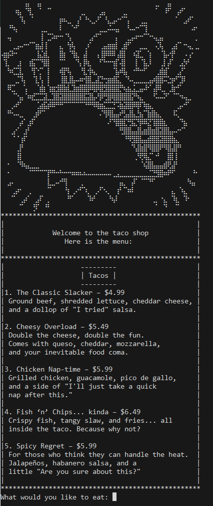
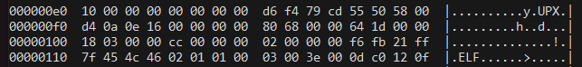
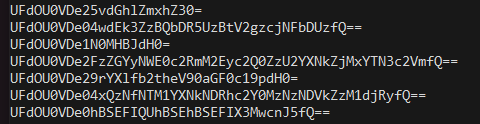

## Taco Time - rev

### Challenge Description
"Just a normal Taco Shop"

### Solution
For this challenge, we are just given a binary ```taco_shop```

To start, I just checked the binary with ```file taco_shop``` -> Looks like it's just a regular 64-bit ELF.

Running the bin, we get this:



I'm a spice fan so I go for the "Spicy Regret," but regardless of input I seem to get the same output:

```Here you go enjoy your meal! I didn't like what you choose so I got you this: Quesadilla Quandary – It's cheesy, it's gooey, and it's got more questions than answers.```

Okay, screw you too.

I probably need to find some kind of password, so we try using ```strings``` - and we get something that looks interesting: ```UFdOU0VDe25vdGhlZmxhZ30=```

Decoding this base64 string we get ```PWNSEC{notheflag}``` - probably not the flag.
Something to note, we also see that the file was packed with upx - so we try unpacking with upx.

This fails, with the error l_info corrupted - this suggests that maybe the header is corrupt. Throwing this into hexview, we see after the ELF header:



So it looks like our typical UPX header isn't there. We pop open hexedit and change the byte after upx to ! and pray that nothing else needs to be repaired...

And boom! We can unpack the binary now. We run ```strings``` again, and this time, we get


Interesting, but none of them are the real flag, just a lot of scams >:(

However, we also see RnIzM19QNGwzU3QxbjMK, which looks interesting.

Base64 decoding this, we get Fr33_P4l3St1n3, our flag.